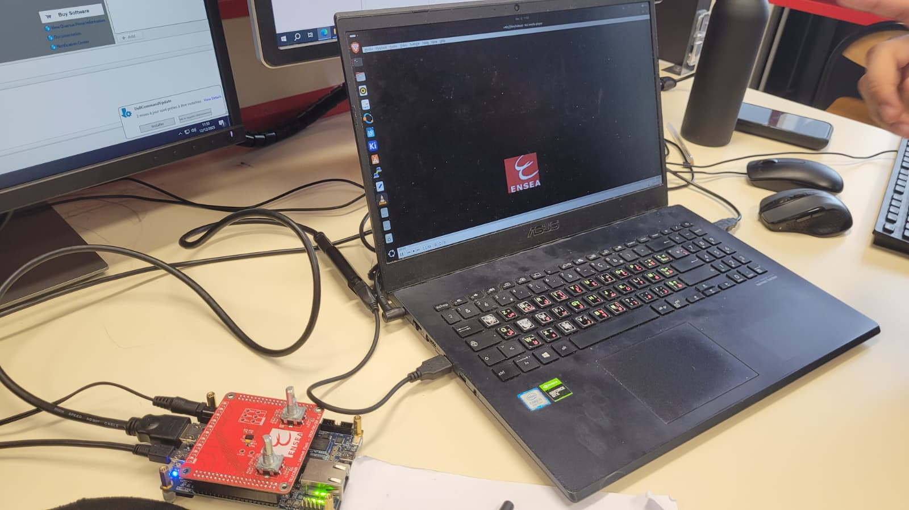

# Rapport de Laboratoire Final : Télécran Numérique sur FPGA

**Auteurs :**
- Houssam HAKKI
- João Pedro PENELU

**Cours :** Développement FPGA  
**Date :** 16 décembre 2025

---

## 1. Introduction et Cahier des Charges

Ce rapport détaille la conception et l'implémentation d'un "Télécran" numérique sur une carte de développement FPGA DE10-Nano. L'objectif est de contrôler un curseur sur un écran HDMI à l'aide de deux encodeurs rotatifs, et de dessiner à l'écran en appuyant sur les boutons-poussoirs.

Le projet est développé de manière incrémentale, suivant les instructions du TP : en commençant par la prise en main de l'environnement et la lecture de base des encodeurs, pour aboutir à une application de dessin complète avec un framebuffer et une fonction d'effacement.

L'ensemble du projet est décrit en VHDL, synthétisé avec **Intel Quartus Prime Lite**, et cible un FPGA **Cyclone V SoC**.

### Environnement de Développement

- **OS** : Linux (Ubuntu)
- **Carte FPGA** : Terasic DE10-Nano (Cyclone V – 5CSEBA6U23I7)
- **Outils** :
  - Intel Quartus Prime Lite (v25.1)
  - ModelSim (pour la simulation VHDL)
- **Interface de programmation** : USB Blaster II
  > Les règles Udev ont été installées pour permettre l'accès au USB Blaster sous Linux.

---

## 2. Prise en main de Quartus et Premiers Pas (TP1)

La première partie du travail a consisté à se familiariser avec le flux de travail de Quartus :

- Création de projet et sélection du FPGA.
- Écriture de modules VHDL simples.
- Assignation des broches (pins) à l'aide du Pin Planner.
- Compilation et programmation du FPGA.

Les fonctionnalités suivantes ont été implémentées et validées sur la carte :
- Contrôle d'une LED par un bouton-poussoir.
- Clignotement d'une LED à l'aide d'une horloge et d'un compteur.
- Basculement de l'état d'une LED avec un bouton de réinitialisation.

---

## 3. Développement du Télécran Numérique

Le cœur du projet consiste à reproduire une version numérique du Télécran (ou *Etch A Sketch*).

### 3.1. Première Implémentation de l'Encodeur et Problématique d'Horloge

La première étape a été de lire les signaux de l'encodeur rotatif pour incrémenter ou décrémenter un compteur, affiché sur les LEDs. La logique repose sur une détection de flancs des signaux en quadrature **A** et **B**.

#### Implémentation VHDL (Version Initiale et Problématique)

```vhdl
architecture rtl of telecran is
    signal a_d1, a_d2 : std_logic := '0';
    signal b_d1, b_d2 : std_logic := '0';
    signal a_rise, a_fall : std_logic;
    signal b_rise, b_fall : std_logic;
    signal cnt : unsigned(9 downto 0) := (others => '0');
begin
    -- Détection de flancs
    a_rise <= '1' when (a_d1 = '1' and a_d2 = '0') else '0';
    a_fall <= '1' when (a_d1 = '0' and a_d2 = '1') else '0';
    b_rise <= '1' when (b_d1 = '1' and b_d2 = '0') else '0';
    b_fall <= '1' when (b_d1 = '0' and b_d2 = '1') else '0';

    process(i_clk_50, i_rst_n)
    begin
        if (i_rst_n = '0') then
            -- ... reset
        elsif rising_edge(i_clk_50) then
            -- Synchronisation des entrées
            a_d1 <= i_left_ch_a;
            a_d2 <= a_d1;
            b_d1 <= i_left_ch_b;
            b_d2 <= b_d1;

            -- Logique de comptage (problématique)
            if (a_rise = '1' and b_d1 = '0') or (a_fall = '1' and b_d1 = '1') then
                cnt <= cnt + 1;
            elsif (b_rise = '1' and a_d1 = '0') or (b_fall = '1' and a_d1 = '1') then
                cnt <= cnt - 1;
            end if;
        end if;
    end process;
    o_leds <= std_logic_vector(cnt);
end architecture rtl;
```

#### Constat et Analyse

Lors des tests sur la carte FPGA, un comportement instable a été observé. La fréquence de l'horloge système (**50 MHz**) est beaucoup trop rapide par rapport à la nature mécanique de l'encodeur. Les rebonds du signal et les oscillations génèrent de multiples transitions non intentionnelles, ce qui entraîne un comptage erroné.

Ce comportement confirme la nécessité de **réduire la fréquence d'échantillonnage effective** à l'aide d'un mécanisme de validation d'horloge (`clock enable`) basé sur un compteur, comme cela sera implémenté dans l'étape suivante.

### 3.2. Gestion Stabilisée des Encodeurs Rotatifs

**Objectif :** Corriger le problème d'instabilité en n'échantillonnant l'état de l'encodeur qu'à une fréquence beaucoup plus basse pour filtrer les rebonds mécaniques.

#### Implémentation VHDL (Version Corrigée)
```vhdl
architecture rtl of telecran is
    -- Signaux pour la détection de flancs
    signal a_d1, a_d2, b_d1, b_d2 : std_logic := '0';
    signal a_rise, a_fall, b_rise, b_fall : std_logic;

    -- Compteur et validation de l'échantillonnage
    signal cnt : unsigned(9 downto 0) := (others => '0');
    signal enc_enable : std_logic := '0';
begin
    -- Logique de détection de flancs
    a_rise <= '1' when (a_d1='1' and a_d2='0') else '0';
    a_fall <= '1' when (a_d1='0' and a_d2='1') else '0';
    b_rise <= '1' when (b_d1='1' and b_d2='0') else '0';
    b_fall <= '1' when (b_d1='0' and b_d2='1') else '0';

    -- Processus pour générer un signal de validation (~1ms) pour l'anti-rebond
    process(i_clk_50, i_rst_n)
        variable counter : natural range 0 to 5000 := 0;
    begin
        if (i_rst_n = '0') then
            counter := 0;
            enc_enable <= '0';
        elsif rising_edge(i_clk_50) then
            if (counter = 5000) then
                counter := 0;
                enc_enable <= '1';
            else
                counter := counter + 1;
                enc_enable <= '0';
            end if;
        end if;
    end process;

    -- Processus principal de la logique de l'encodeur, maintenant stabilisé
    process(i_clk_50, i_rst_n)
    begin
        if (i_rst_n = '0') then
            a_d1 <= '0'; a_d2 <= '0'; b_d1 <= '0'; b_d2 <= '0';
            cnt  <= (others => '0');
        elsif rising_edge(i_clk_50) then
            -- Synchronisation des entrées
            a_d1 <= i_left_ch_a; a_d2 <= a_d1;
            b_d1 <= i_left_ch_b; b_d2 <= b_d1;

            if enc_enable = '1' then -- On ne traite la logique que sur validation
                if (a_rise='1' and b_d1='0') or (a_fall='1' and b_d1='1') then
                    cnt <= cnt + 1;
                elsif (b_rise='1' and a_d1='0') or (b_fall='1' and a_d1='1') then
                    cnt <= cnt - 1;
                end if;
            end if;
        end if;
    end process;

    o_leds <= std_logic_vector(cnt);
end architecture rtl;
```

#### Explication de la Correction :

1.  **Anti-rebond (Debouncing) :** Un signal de validation `enc_enable` est généré. Un compteur tourne sur l'horloge de 50 MHz et active `enc_enable` pendant un seul cycle toutes les ~1ms (5000 cycles).
2.  **Logique de Comptage Stabilisée :** La logique d'incrémentation/décrémentation est maintenant conditionnée par `if enc_enable = '1'`. Cela garantit que l'état de l'encodeur n'est lu qu'à des intervalles stables, immunisant le système contre les rebonds et le bruit mécanique.

### 3.3. Intégration et Test du Contrôleur HDMI

**Objectif :** Intégrer le module VHDL `hdmi_controler` pour générer un signal vidéo 720x480. Pour le premier test, les compteurs X/Y internes du contrôleur sont visualisés directement sur la sortie couleur.

#### Validation de la Sortie Vidéo

Le signal HDMI a été connecté à un adaptateur de capture **HDMI vers USB**, permettant d'afficher la sortie vidéo du FPGA directement sur l'ordinateur. Un signal vidéo valide a été généré avec succès, confirmant :
- La génération correcte de l'horloge pixel par la **PLL**.
- La configuration I2C fonctionnelle du transmetteur HDMI.
- Le chemin de données HDMI opérationnel du FPGA à l'ordinateur.


> *Le banc de test utilisé : DE10-Nano, adaptateur de capture HDMI-USB, et PC portable affichant la sortie vidéo.*

#### Implémentation VHDL
```vhdl
architecture rtl of telecran is
    -- ...
    -- Sorties de la PLL et du contrôleur HDMI
    signal s_clk_27     : std_logic;
    signal pll_locked   : std_logic;
    signal s_rst_n      : std_logic;
    signal s_hs, s_vs, s_de : std_logic;
    signal s_x_counter : natural range 0 to h_res-1;
    signal s_y_counter : natural range 0 to v_res-1;
begin
    -- Instanciation de la PLL pour générer l'horloge pixel de 27 MHz
    pll0 : component pll port map (...);
    s_rst_n <= i_rst_n and pll_locked;

    -- Instanciation du générateur de synchronisation HDMI
    u_hdmi_ctrl : entity work.hdmi_controler
        port map (
            i_clk   => s_clk_27,
            i_rst_n => s_rst_n,
            o_hdmi_hs => s_hs, o_hdmi_vs => s_vs, o_hdmi_de => s_de,
            o_x_counter => s_x_counter, o_y_counter => s_y_counter,
            ...
        );

    -- Acheminer les signaux vers les broches HDMI physiques
    o_hdmi_tx_clk <= s_clk_27;
    o_hdmi_tx_hs  <= s_hs;
    o_hdmi_tx_vs  <= s_vs;
    o_hdmi_tx_de  <= s_de;

    -- Mapper les compteurs X/Y sur les canaux Rouge/Vert pour visualisation
    o_hdmi_tx_d(23 downto 16) <= std_logic_vector(to_unsigned(s_x_counter, 10)(7 downto 0));
    o_hdmi_tx_d(15 downto 8)  <= std_logic_vector(to_unsigned(s_y_counter, 9)(7 downto 0));
    o_hdmi_tx_d(7 downto 0)   <= (others => '0');
end architecture rtl;
```
Le résultat est un dégradé coloré à l'écran, validant le balayage correct des compteurs.

### 3.4. Déplacement d'un Pixel

**Objectif :** Utiliser les deux encodeurs pour contrôler la position (X, Y) d'un curseur (carré blanc de 8x8 pixels) à l'écran.

#### Implémentation VHDL
```vhdl
architecture rtl of telecran is
    -- ...
    -- Compteurs et positions X/Y
    signal cnt_x : unsigned(9 downto 0);
    signal cnt_y : unsigned(8 downto 0);
    signal s_x_pos : natural range 0 to h_res-1;
    signal s_y_pos : natural range 0 to v_res-1;
begin
    -- ... (Logique dupliquée pour le 2e encodeur contrôlant cnt_y)

    -- Processus pour limiter les coordonnées à la taille de l'écran
    process(cnt_x, cnt_y) begin
        -- ...
    end process;

    -- Processus de génération vidéo : dessine un carré blanc à la position du curseur
    process(s_de, s_x_counter, s_y_counter, s_x_pos, s_y_pos)
    begin
        if (s_de = '1') then -- Si dans la zone d'affichage active
            o_hdmi_tx_d <= x"202020"; -- Fond gris
            if (s_x_counter >= s_x_pos and s_x_counter < s_x_pos + 8 and
                s_y_counter >= s_y_pos and s_y_counter < s_y_pos + 8) then
                o_hdmi_tx_d <= x"FFFFFF"; -- Curseur blanc
            end if;
        else
            o_hdmi_tx_d <= x"000000"; -- Noir (blanking)
        end if;
    end process;
end architecture rtl;
```
La logique de dessin compare en temps réel les coordonnées de balayage de l'écran (`s_x_counter`, `s_y_counter`) avec la position du curseur (`s_x_pos`, `s_y_pos`).

### 3.5. Mémorisation avec Framebuffer

**Objectif :** Conserver les pixels dessinés à l'écran. Cela nécessite un **framebuffer**, une mémoire qui stocke l'état de chaque pixel. Une **RAM à double port** est utilisée pour éviter les conflits d'accès entre l'écriture (pilotée par l'utilisateur) et la lecture (pilotée par le balayage vidéo).

#### Implémentation VHDL
```vhdl
architecture rtl of telecran is
    -- ...
    -- Signaux du framebuffer
    constant FB_SIZE : natural := h_res * v_res;
    signal s_wr_addr, s_rd_addr : natural range 0 to FB_SIZE-1;
    signal s_fb_q_b  : std_logic_vector(7 downto 0); -- Donnée lue de la RAM
    signal s_draw_we : std_logic; -- 'Write Enable' pour le dessin
begin
    -- ...
    -- Adresses RAM: écriture (curseur) et lecture (balayage)
    s_wr_addr <= s_y_pos * h_res + s_x_pos;
    s_rd_addr <= s_y_counter * h_res + s_x_counter;
    s_draw_we <= i_left_pb or i_right_pb;

    -- Instanciation de la RAM à double port (dpram)
    u_fb : entity work.dpram port map (
        i_clk_a  => i_clk_50,   -- Port A (Écriture) cadencé par l'horloge système
        i_we_a   => s_we_a,
        i_addr_a => s_addr_a,
        i_data_a => s_data_a,
        i_clk_b  => s_clk_27,   -- Port B (Lecture) cadencé par l'horloge pixel
        i_addr_b => s_rd_addr,
        o_q_b    => s_fb_q_b
    );

    -- Processus vidéo : affiche le contenu du framebuffer
    process(s_de, s_fb_q_b)
    begin
        if (s_de = '1') then
            if (s_fb_q_b /= x"00") then
                o_hdmi_tx_d <= x"FFFFFF"; -- Blanc si pixel mémorisé
            else
                o_hdmi_tx_d <= x"000000"; -- Noir sinon
            end if;
        else
            o_hdmi_tx_d <= x"000000";
        end if;
    end process;
end architecture rtl;
```
Une logique d'effacement au démarrage (`s_clr_en`) parcourt toute la RAM pour y écrire des zéros, garantissant un écran propre.

### 3.6. Effacement de l'Écran

**Objectif :** Permettre à l'utilisateur d'effacer l'écran en appuyant sur le bouton-poussoir de l'encodeur gauche.

#### Implémentation VHDL
```vhdl
architecture rtl of telecran is
    -- ...
    signal erase_req : std_logic := '0'; -- Requête d'effacement
begin
    -- ...
    -- Détection du flanc descendant du bouton d'effacement
    process(i_clk_50, i_rst_n)
    begin
        -- ...
        if (left_pb_d = '1' and i_left_pb = '0') then
            erase_req <= '1';
        else
            erase_req <= '0';
        end if;
    end process;

    -- Logique d'effacement modifiée, déclenchée par reset OU erase_req
    process(i_clk_50, i_rst_n)
    begin
        if (i_rst_n = '0') or (erase_req = '1') then
            s_clr_en   <= '1'; -- (Ré)activer la séquence d'effacement
            s_clr_addr <= 0;
        end if;
        -- ... séquence d'effacement ...
    end process;

    -- Le dessin se fait maintenant avec le bouton droit pour éviter les conflits
    s_draw_we <= i_right_pb;
end architecture rtl;
```
La séquence d'effacement est maintenant réutilisable à la demande de l'utilisateur.

---

## 4. Conclusion

Ce projet a permis de mettre en pratique un large éventail de concepts en conception de systèmes numériques. En partant d'une simple interaction avec des LEDs, le projet a évolué vers une application vidéo interactive complexe. Les compétences clés maîtrisées incluent :

-   **Logique Séquentielle et Combinatoire :** Compteurs, détecteurs de flancs, machines d'états.
-   **Gestion d'Horloge :** Utilisation d'une PLL pour générer des horloges spécifiques.
-   **Interfaces Périphériques :** Lecture d'encodeurs et pilotage d'un transmetteur HDMI.
-   **Génération de Signaux Vidéo :** Implémentation des timings vidéo (synchro, blanking).
-   **Interface Mémoire :** Utilisation d'une RAM à double port pour gérer des accès concurrents dans des domaines d'horloge différents.

L'implémentation finale du Télécran est entièrement fonctionnelle et répond à toutes les exigences du cahier des charges du TP.
